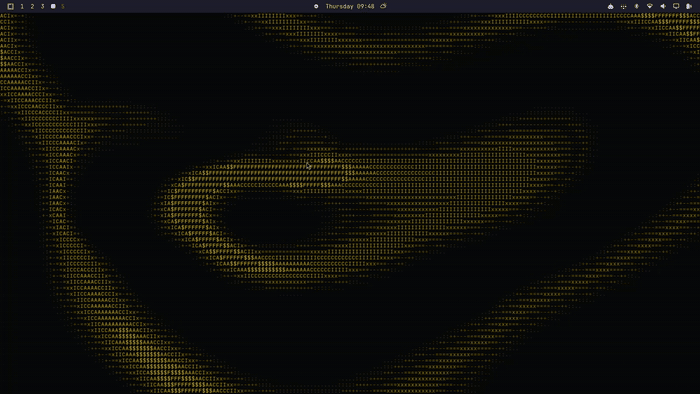

# asciipaper

Live, animated, mouse-interactive **ASCII wallpapers** for [Omarchy](https://omarchy.org), Arch Linux and any Wayland compositor with layer-shell (Hyprland, Sway, river, niri…).

Any web page — a preset, a URL, or a local `.html` — rendered GPU-accelerated in WebKitGTK and pinned to the desktop **background layer** of every monitor with [gtk4-layer-shell](https://github.com/wmww/gtk4-layer-shell). Pointer events reach the page when the cursor is over the bare desktop, so wallpapers react to the mouse. Isolated from the shell (can't crash it), idles when covered by windows, runs as a systemd user service.

Ships with an offline, 1:1 port of the [asciify.org Fluid background](https://asciify.org/docs/backgrounds/fluid).



_[Full-quality demo (MP4)](assets/demo.mp4)_

## Install

```sh
git clone https://github.com/cYoren/asciipaper && cd asciipaper && ./install.sh
```

Deps: WebKitGTK 6.0, gtk4-layer-shell, PyGObject. `install.sh` knows pacman (tested), dnf and apt (untested — PRs welcome). Remove with `./install.sh uninstall`.

Works on any Wayland compositor that implements `wlr-layer-shell`: Hyprland, Sway, niri, river, Wayfire, labwc, KDE Plasma. Not GNOME (Mutter has no layer-shell) and not X11.

## Windows / macOS

The engine is Wayland-only, but every wallpaper in `wallpapers/` is a plain single-file web page with zero dependencies. Point an HTML-wallpaper tool at it:

- **Windows** — [Lively Wallpaper](https://github.com/rocksdanister/lively) (free, open source) or Wallpaper Engine → add `wallpapers/fluid.html` as a web wallpaper.
- **macOS** — [Plash](https://github.com/sindresorhus/Plash) (free, open source) → open `file:///…/wallpapers/fluid.html`.

## Use

```sh
asciipaper list                 # presets
asciipaper set fluid            # Asciify's Fluid background, offline port (default)
asciipaper set flow             # stable-fluids sim, character ramp (offline)
asciipaper set matrix           # matrix rain (offline)
asciipaper set asciify          # the live asciify.org page (needs internet)
asciipaper set https://…        # any page
asciipaper set ~/my/rain.html   # any local file
```

`set` saves to `~/.config/asciipaper/wallpaper` and restarts the service. Run `asciipaper <target>` directly to try one without saving.

## Write your own (or ask an AI to)

A wallpaper is one self-contained `.html` file. The contract:

- Fill the viewport: `html,body{margin:0;height:100%;overflow:hidden}` and a `<canvas>` (or a monospace `<pre>`) sized to `innerWidth × innerHeight`; re-size on the `resize` event.
- Animate with `requestAnimationFrame` or `setInterval`; draw characters with `ctx.fillText` in a monospace font (that's what makes it "ASCII").
- It's **pointer-interactive**: `mousemove` / `pointerdown` / `wheel` fire when the cursor is over the bare desktop, so react to them (ripples, wake-up, parallax). Keyboard focus is off by design.
- WebGL is on; no network needed for local files. Any JS the page needs must be inline or bundled — no build step, no server.

`wallpapers/flow.html` is the reference: a ~90-line stable-fluids sim (inject → advect → pressure-project) drawn as a character ramp, with ambient drift so it moves without a cursor. `matrix.html` is the 25-line minimum. `fluid.html` shows how to feed any grayscale painter through the asciify engine (`lib/asciify-core.js` is available to every local wallpaper via `import … from './lib/asciify-core.js'`). Drop your file anywhere and `asciipaper set /path/to/it.html`, or add it to `wallpapers/` and `PRESETS` and send a PR.

Prompt that works: *"Write a single-file HTML live ASCII wallpaper for asciipaper: full-screen canvas, monospace fillText, animated with requestAnimationFrame, reacts to mousemove. Theme: ‹ocean waves›."*

## Tuning `fluid`

The whole frame runs on the GPU (liquid field, tint and glyph atlas in two fragment shaders; the engine's luminance→glyph table is read once at startup), so it costs **~5 % of one core at 1080p** and ~0 when covered. Top of `wallpapers/fluid.html`: `MIN_FONT` (glyph cell px; 7 = asciify.org, 5–6 = finer), `SCALE` (supersampling; 2 = smoother letters), `FPS` (24; the fluid is slow, 30 buys nothing visible), `OPTIONS.charset` / `accentColor`. After editing: `asciipaper set fluid`.

## Add a preset

Edit `PRESETS` in `asciipaper`: `name: (url, selector)`. The selector (optional) is the element to isolate — everything else on the page is removed so the canvas fills the screen.

## Notes

- One full-screen surface per monitor; monitors plugged in later get one too.
- Uses the compositor's `background` layer, so it sits under Omarchy's shell, bars and windows. When fully covered, WebKit stops rendering, so it costs ~0 CPU while you work.
- Omarchy theme changes don't touch it; `asciipaper set …` is the only knob.
- For AI agents: see [`skills/asciipaper/SKILL.md`](skills/asciipaper/SKILL.md) — install with `npx skills add cYoren/asciipaper`.

## Credits

- `wallpapers/fluid.html` is the [asciify.org Fluid background](https://asciify.org/docs/backgrounds/fluid) running offline: `FluidField` + `paintLiquidSource` ported from [asciify-engine](https://github.com/ayangabryl/asciify-engine) `src/surface/fluid-field.ts`, glyphs rendered by the unmodified engine (`wallpapers/lib/asciify-core.js`, v4.1.0). By [ayangabryl](https://github.com/ayangabryl), MIT — `licenses/asciify-engine-MIT.txt`.
- Background layer via [gtk4-layer-shell](https://github.com/wmww/gtk4-layer-shell).

## License

MIT
