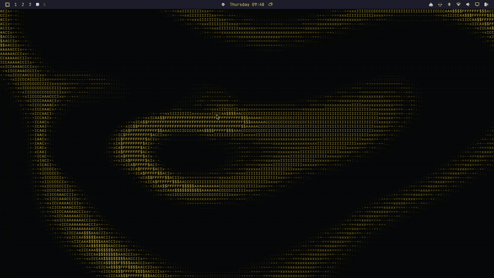
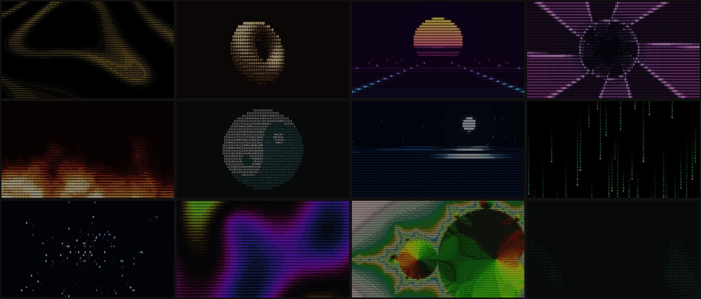
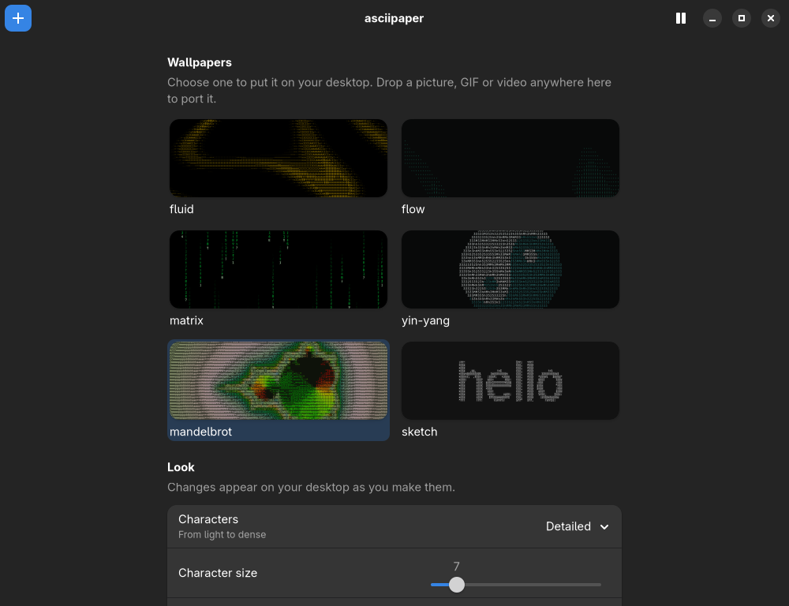
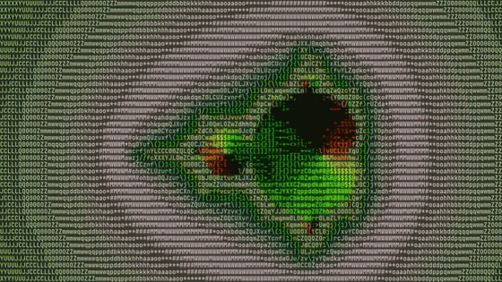

# asciipaper

Live **ASCII wallpapers** for Windows and Linux. Pick one and click Apply, or turn any picture, GIF or video (even a post on X) into ASCII art that moves on your desktop. Write your own as a single GLSL function.

**[⬇ Download for Windows 10 and 11](https://github.com/cYoren/asciipaper/releases/latest)** (`asciipaper-setup-….exe`) · Linux: [below](#install)





- **Light.** A small native engine (C, OpenGL ES) draws on the GPU: under 1% of a CPU core and about 100 MB on Linux. Wallpapers stop drawing behind fullscreen and maximized windows, and while the PC is locked.
- **Calm by default.** Wallpapers react to the pointer like liquid (fluid, yin-yang) and never chase it. Click ripples and the hover lens are there if you want them (Settings, Customize).
- **Port anything.** Pictures, GIFs, videos, links, and posts on X or Twitter. asciipaper measures the media and picks a starting look: levels, colours, and which parts get the dense characters.
- **Customizable, live.** Characters, size, weight, glow, colours, contrast, fit, backdrop and effects all change on your desktop as you move the sliders.
- **Windows and Linux.** A Windows app with an installer (behind your desktop icons, every monitor, tray icon, starts with Windows). On Linux, Wayland desktops with layer-shell (Hyprland, KDE Plasma, Sway, niri, COSMIC, river, Wayfire, labwc). Exports for Wallpaper Engine, Lively and Plash (macOS); videos and GIFs for everything else.

## Install

**Windows 10 and 11**: download `asciipaper-setup-….exe` from [Releases](https://github.com/cYoren/asciipaper/releases/latest) and run it. No administrator rights and nothing else to install (it uses .NET Framework and WebView2, which come with Windows). The installer isn't code-signed yet, so Windows may say it "protected your PC": choose **More info → Run anyway**. asciipaper then lives in the tray and starts with Windows.

**Arch Linux** (AUR):

```sh
yay -S asciipaper
systemctl --user enable --now asciipaper.service
```

**From source** (Arch, Fedora, Debian/Ubuntu; installs into `~/.local`):

```sh
git clone https://github.com/cYoren/asciipaper && cd asciipaper && ./install.sh
```

Packagers: `make && make install PREFIX=/usr DESTDIR=…`. Runtime: Python 3 with PyGObject, GTK 4, libadwaita, gtk4-layer-shell, WebKitGTK 6.0 (for HTML wallpapers), and optionally ffmpeg (porting and recording). The engine needs wayland, EGL/GLES 2 and pango, and wayland-protocols to build.

## Use

Open **asciipaper** from your launcher (or `asciipaper --studio`):



Click a wallpaper to put it on your desktop. Use **+** or drag a file onto the window to port a picture, GIF or video. The Look panel changes the selected port live. Or from a terminal:

```sh
asciipaper list                        # everything in your library
asciipaper set matrix                  # choose (and keep) a wallpaper
asciipaper import ~/Videos/rain.mp4    # port a picture, GIF or video…
asciipaper import https://x.com/…/status/…   # …or a link, or a post on X
asciipaper create aurora               # start your own shader wallpaper
asciipaper export aurora               # ZIP for Windows and macOS
asciipaper render aurora aurora.mp4    # record a video or GIF
```

## Let your AI agent design wallpapers

asciipaper is also an MCP server. Hook it up and ask Claude, Cursor or any MCP client for a look in plain words ("a slow aurora in teal", "port this video, make it greener"). The agent writes the shader, **sees a snapshot of every attempt** (shader errors come back to it too), and puts the one you like on your desktop.

```sh
claude mcp add --scope user asciipaper -- asciipaper mcp        # Claude Code
```

Anywhere else, add a stdio server with the command `asciipaper mcp`. Tools: `list_wallpapers`, `get_wallpaper`, `write_wallpaper`, `snapshot`, `set_wallpaper`, `import_media`, `render`.

## Port anything



`asciipaper import` accepts a file, a direct link, or a post on X or Twitter (through the public [fxtwitter](https://github.com/FixTweet/FxTwitter) API). It decodes the media once with ffmpeg into small frames the engine plays in a loop, and writes a wallpaper spec, `~/.local/share/asciipaper/user-wallpapers/NAME.json`, with a starting look measured from the media:

- stretches its brightness to use every character;
- takes a tint and a dark background from its average colour;
- inverts paper-like pictures (sketches, line art, text), so the drawing gets the dense characters.

Everything the Studio's Look panel changes lives in that file, so you can also edit it by hand while it runs.

## Add a wallpaper to asciipaper

Built-in wallpapers are just files. Put `NAME.json` and `NAME.glsl` (the spec format below) in [`wallpapers/specs/`](wallpapers/specs/) and it appears in both apps, on Windows and Linux, and in exports: no code to change. Add a thumbnail with `native/asciipaper-engine --spec wallpapers/specs/NAME.json --lib wallpapers/lib --snapshot wallpapers/thumbnails/NAME.jpg --size 960x540 --seconds 3` and open a pull request. Customizing a built-in in the apps makes your own copy, so the originals stay as shipped.

## Make your own

A wallpaper can be a **shader spec**: a JSON file plus a GLSL function that runs once per character. asciipaper-engine runs it natively; the same files run in a browser, so they export to Windows and macOS unchanged.

```sh
asciipaper create aurora     # makes aurora.json + aurora.glsl in ~/.local/share/asciipaper/user-wallpapers
asciipaper set aurora        # put it on your desktop; saving either file updates it live
```

```glsl
// defaults: {"speed": 1}
uniform float speed;                       // set from the spec's "uniforms"
vec4 cell(vec2 uv) {                       // uv: this character's centre, 0..1 from the top left
  float d = length((uv - u_pointer) * vec2(u_aspect, 1.0));
  float level = 0.5 + 0.5 * sin(d * 30.0 - u_time * 3.0 * speed);
  return vec4(0.2, 0.8, 0.7, level);       // colour, and level 0..1 picks the character
}
```

Built-in uniforms: `u_time` (s), `u_grid` (columns, rows), `u_size` (px), `u_aspect`, `u_pointer` (0..1), `u_velocity`, `u_down`, `u_idle` (s since the pointer moved), `u_strength` (the pointer setting) and `u_clicks[8]` (x, y, age in s; empty unless the user turned on click effects). A shader error prints to the terminal (or `journalctl --user -u asciipaper`) and the last good version keeps running.

The spec (`aurora.json`):

| Key | Meaning |
|---|---|
| `shader` | a `.glsl` file beside the spec, inline GLSL, or `"media"` (the built-in picture shader) |
| `media` | a picture, GIF or video beside the spec (made by `asciipaper import`) |
| `charset` | characters from light to dense, the first usually a space |
| `cell`, `aspect` | character width in px, and width / height |
| `weight`, `font` | font weight (100–900) and family |
| `fill` | 0–1: each character's colour, faintly, behind it |
| `background` | `"#rrggbb"` |
| `maxCells` | caps the grid on huge screens (default 40000) |
| `uniforms` | values for the shader's uniforms: numbers, `[x, y]`, or `"#rrggbb"` colours |

The media shader's settings (`uniforms` of a port) are `fit` (0 whole picture, 1 fill), `zoom`, `offset`, `contrast`, `brightness`, `gamma`, `threshold`, `invert`, `colorMode` (0 own colours, 1 tint, 2 gradient), `vivid`, `tint`, `tint2`, `backdrop`, `lens` (hover magnifier, off by default), `ripple` (needs click effects on) and `speed`. See [`wallpapers/lib/media.glsl`](wallpapers/lib/media.glsl).

### HTML wallpapers

Any web page also works (in WebKit): `asciipaper set https://…`, `asciipaper set ~/page.html`, or `asciipaper create NAME --html` for a starter. `lib/asciipaper.js` gives HTML wallpapers the same ASCII renderer, pacing and input:

```html
<script src="./lib/asciipaper.js"></script>
<script>
asciipaper.ascii({charset: ' .:-=+*#%@', cell: 10, aspect: .6,
  glsl: `vec4 cell(vec2 uv) { return vec4(0.2, 0.8, 0.7, 0.5 + 0.5 * sin(uv.x * 20.0 + u_time)); }`,
  update(scene, dt) { /* set scene.uniforms.x, or scene.put(col, row, level, r, g, b) without glsl */ }});
</script>
```

Options: `font`, `weight`, `fill`, `background`, `maxCells`, `lut` (256 glyph indices), `time`/`period`, `resize(scene)`, `scene.texture(name, w, h, rgba)`. Input: `asciipaper.pointer` or DOM pointer events (never the keyboard). Settings: `asciipaper.options` and `asciipaper.onChange()`. The engine paces `requestAnimationFrame` for you. `asciipaper preview FILE` opens a window that reloads on save and prints console errors. Examples: [`wallpapers/`](wallpapers/).

Prompt that works: *"Write an asciipaper shader wallpaper: a GLSL `vec4 cell(vec2 uv)` returning colour and a 0..1 level, using `u_time`, `u_pointer` and `u_clicks` (see the README). Theme: ‹ocean waves›."*

## Windows, macOS, GNOME, phones

- **Windows and macOS:** `asciipaper export NAME` (or Share in the Studio) makes one ZIP. In **Wallpaper Engine**, open its `project.json`; in **Lively Wallpaper**, drag the ZIP in; on macOS, unzip and add `index.html` to **Plash**. The wallpaper stays interactive, and each app's settings panel controls the frame rate, quality and pointer response.
- **GNOME, X11, phones, sharing:** these can't host a live Wayland wallpaper, but `asciipaper render NAME out.mp4` (or `.webm`, `.gif`) records one: ports record whole loops, everything else 10 seconds (`--seconds`, `--size`). Use it with a video-wallpaper app or extension, or post it.

## Performance

The engine draws at `fps` (24) while the pointer is on the desktop and `idleFps` (12) otherwise, and doesn't draw at all when the compositor isn't showing a monitor or, on Hyprland, when a fullscreen window covers it. The Studio's Performance section sets these, the render quality and the pointer response, and shows the engine's measured CPU. Settings live in `~/.config/asciipaper/engine.json`; `"renderer": "web"` runs everything in WebKit instead.

Measured on an Intel laptop at 9 fps across two monitors plus a virtual one: 0.5–0.6% CPU and about 110 MB for fluid, matrix and yin-yang (flow simulates on the CPU: 2.7%). The WebKit build of matrix used 8% and about 1 GB.

WebKit applies the desktop's text-scaling factor as page zoom, so with text scaling above 1 the web versions draw larger characters than the native engine.

## Notes

- One background surface per monitor, including monitors plugged in later. It sits under your bars and windows and never takes the keyboard.
- The built-in scenes' shaders exist twice: in `wallpapers/*.html` (web) and `native/presets.c` (native). Change both together.
- `asciipaper-engine --snapshot out.png` renders any wallpaper offscreen, without a compositor (thumbnails, tests).
- Flatpak: the manifest builds, but Flatpak's Wayland socket filters out layer-shell, so a Flatpak can edit and export wallpapers but not show them. Use the native package.
- For AI agents: [`skills/asciipaper/SKILL.md`](skills/asciipaper/SKILL.md), or `npx skills add cYoren/asciipaper`.

## Credits

- `fluid` is the [asciify.org Fluid background](https://asciify.org/docs/backgrounds/fluid), offline: `FluidField` and `paintLiquidSource` ported from [asciify-engine](https://github.com/ayangabryl/asciify-engine) by [ayangabryl](https://github.com/ayangabryl), MIT ([`licenses/asciify-engine-MIT.txt`](licenses/asciify-engine-MIT.txt)). Its glyph table comes from the unmodified engine (`wallpapers/lib/asciify-core.js`).
- Layer-shell protocol from [wlr-protocols](https://gitlab.freedesktop.org/wlroots/wlr-protocols); the Studio's background layer through [gtk4-layer-shell](https://github.com/wmww/gtk4-layer-shell).
- Posts on X are fetched through [FxTwitter](https://github.com/FixTweet/FxTwitter). Only port media you have the right to use.

## License

MIT
